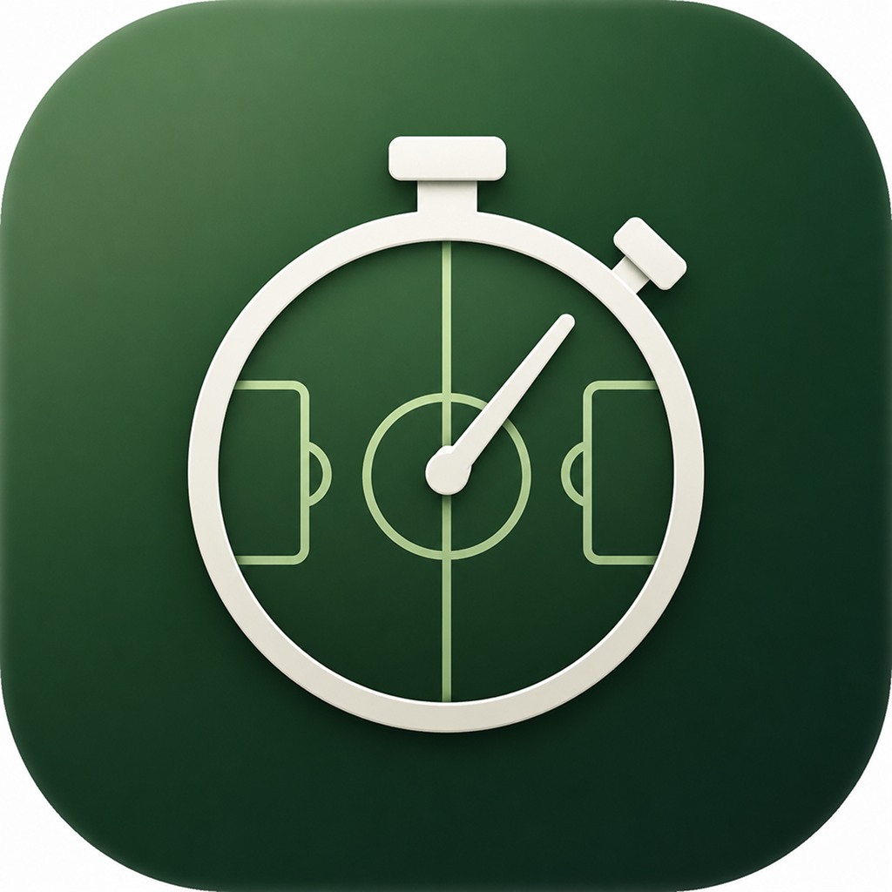
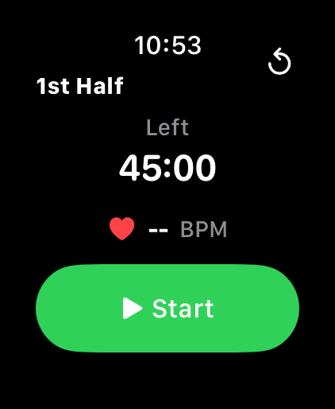

<h1>
  
  TempoFutebol
</h1>

TempoFutebol is a lightweight watchOS app to run a football (soccer) match clock directly from Apple Watch.

It supports first/second half flow, pause/resume controls, whistle transitions, and added-time display.

  

## Features

- Match timer with `45:00` regulation time per half
- Whistle-controlled added-time phase after regulation time
- Start, pause, resume, whistle, and reset controls
- Phase transitions (`regulation` -> `added time` -> half-time/full-time)
- Match state persistence across app relaunch
- Battery-friendlier ticking (per-second updates only while running)
- Heart-rate pill from HealthKit samples (when permission is granted)
- Extended runtime session while the match clock is running, keeping the app frontmost for supported watchOS sessions
- Always On display layout with a simplified time-only reduced-luminance view
- Compact runtime status indicator with a one-time haptic warning near the runtime limit

## Tech Stack

- Swift
- SwiftUI
- Combine
- watchOS target via Xcode project

## Project Structure

- `TempoFutebol Watch App/` - main watch app target
  - `ContentView.swift` - UI and controls
  - `ViewModels/MatchClockViewModel.swift` - state machine and timing logic
  - `Models/MatchClockState.swift` - domain types and display models
- `TempoFutebol.xcodeproj/` - Xcode project configuration

## Requirements

- macOS with Xcode installed
- watchOS Simulator (or paired real Apple Watch for device testing)

## Build and Run

1. Open `TempoFutebol.xcodeproj` in Xcode.
2. Select the `TempoFutebol Watch App` scheme.
3. Choose a watchOS simulator/device destination.
4. Run the app (`Cmd + R`).

## Real Watch Always On Checklist

- Enable Always On in Apple Watch Settings.
- Set Return to Clock to `1 hour` for TempoFutebol.
- Start a match on the real watch, lower your wrist, and confirm the simplified time-only screen stays visible.
- Leave the timer running past 55 minutes and confirm the subtle awake-limit warning appears once.

## Testing

The repository includes unit tests for core match-clock behavior:

- state transitions (start/pause/resume/whistle)
- half and match completion rules
- reset behavior
- persistence restore behavior
- extended runtime session status and runtime-limit warning behavior

Run tests from Xcode (`Cmd + U`) on the `TempoFutebol Watch App` scheme.

## Contributing

Issues and pull requests are welcome. Keep changes focused, small, and validated with tests.
